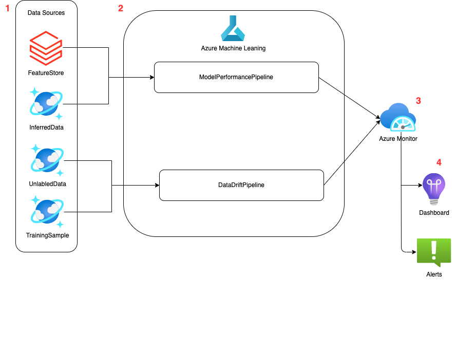

# Model Performance and Data Drift Monitoring

## The Scope of this Document
The provided design assumes that the data are already stored in Azure Storage. The processes of collecting data into or pulling the data from Cosmos DB or the feature store are not covered in this document.

## Requirements
The solution requires that an Azure ML instance will be available in the production environment. 

## Before Deploying a Model
When a model is ready to be pushed to production, it will be the data scientists' responsibility to provide the code required for monitoring, by altering the provided monitoring template (see the [Monitoring Template](#monitoring-template) section of this document for more details).

## Monitoring Design
The monitoring workflow is depicted in the image below. The document assumes that all the required data is stored in Cosmos DB and readily available for use.



### Data Sources
The data used to run this template are stored in the [sample_data](./sample_data/) folder. The data are a small tabular set that contain both continuous and categorical features. the target variable is binary, and indicates whether the operation line needs to go through preventive maintenance. 

The monitoring tool uses four data sources in order to run the pipelines:
* GroundTruth ([new_data_groundtruth.csv](./sample_data/new_data_groundtruth.csv)): contains the actual labels of the inferred data. This data will only be available after providing the model's predictions, and will be used to evaluate the performance of teh model.
* UnlabledData ([new_data.csv](./sample_data/new_data.csv)): contains the new data that are sent to the ML model for inference.
* InferredData ([new_data_inference.csv](./sample_data/new_data_inference.csv)): contains, for each id in the new data set, the predictions made by the ML model
* TrainingSample ([reference_data.csv](./sample_data/reference_data.csv)): a sample of the training set (copied from the TRE) 

### Azure Machine Learning
In Azure ML, we will have two pipelines - one for model performance monitoing and another one for drift detection.

The pipelines will be triggered automatically to run at a predefined frequency. One can also choose to trigger the pipeline using Azure Piplines or Github Actions. The implementation of this approach is out of the scope of this document.

#### *Model Performance Pipeline*
Inputs: model predictions and their corresponding ground truths (when they become available)
The script will compute the model's performance by comparing the predictions that were made by the model to the ground truth.

#### *Data Drift Pipeline*
Inputs: A sample of the training data, a set of new data
Output: For each feature, the script will determine whether a data drift occurred or not. 

In the provided template, we used the [alibi-detect](https://github.com/SeldonIO/alibi-detect) open source library to compute the data drift. However, the data scientist can decide on the best monitoring tools based on the use case [^1]
[^1]: For example, when working with images, we could use [Torchdrift](https://torchdrift.org/) or the[Deepchecks](https://deepchecks.com/) open source library to detect the data drift
 
If we would also like to support label drift, in addition to the training set, we will also need to save the predictions the model made on the training data so that we can compare the distribution of the predictions.

The pipelines record the selected metrics and graphs using MLFlow and also send metrics to Azure Monitor

### Azure Monitor
In [Azure Monitor](https://learn.microsoft.com/en-us/azure/azure-monitor/overview), we will define queries and use them to set alerts and create dashboards. The alerts can be linked to email accounts (or to a [Teams](https://techcommunity.microsoft.com/t5/core-infrastructure-and-security/azure-monitor-alert-notification-via-teams/ba-p/2507676) channel) of the data scientist responsible for the model. When an alert is triggered, the data scientist can view the monitoring dashboard to get some more information about what has trigerred it.

## Monitoring Template
The monitoring template is meant to help the data scientist create the artifacts required to run the monitoring workflow.
There are two ways to run a recurring job in AML. The first one is byy linking the AML pipeline to Azure Pipelines (or Git actions), and the second one is by trigerring the recurrent job directly from AML. 
To setup the workflow, the data scientist will need to follow the following steps:
### **Step 1: Upload the data to Azure Blob Storage**
To run the template, make sure that the files stored in the [sample_data](./sample_data/) folder are uploaded to Azure blob storage in a folder named `model_monitoring`
### **Step 2: Define the drift and model performance metrics** 
In the `data_drift` and `model_performance` folders, edit the source code (e.g `data_drift/data_drift_src/data_drift.py`) to define the monitoring functions. 
   * For data drift, the template supports running Kolmogorov-Smirnov algorithm for all continuous variables and Chi-squared tests for all categorical variables.

If the drift or performance metrcs were measured using a library that is not in the `env.yml` file, make sure to add it there.

### **Step 3: Configure AML and model parameters**
Modify the `config.json` file to point to the location of the data sources and to select the compute name (the assumption is that a compute has already been created in AML).
In order to connect to AML, you will also need to provide the subscription ID, resource group, workspace name and Azure Application Insight connection string.
### **Step 4: Configure a Recurring Job in AML**
In the `data_drift_main.py` and `model_performance_main`, uncomment the block that generates a recurrent job. The jobs can be monitored and disabled in AML or using the SDK (see [here](https://learn.microsoft.com/en-us/azure/machine-learning/how-to-schedule-pipeline-job?tabs=python) for more details on how to schedule and manage recurring jobs)
### **Step 5: Run the pipeline**
When the run completes, the artifacts will be stored in the AML run. 
### **Step 6: Model Monitoring**
The logs that were saved to Azure Monitor are stored in the `traces` table. They can be queried using [Kusto Query Language (KQL)](https://learn.microsoft.com/en-us/azure/data-explorer/kusto/query/) 

For example, run the following query to detect if a drift has occurred:
```
traces
| where message == 'data_drift_total'
| project toreal(customDimensions.is_drift)
```
These queries can be used to [create alerts](https://learn.microsoft.com/en-us/azure/azure-monitor/alerts/alerts-create-new-alert-rule?tabs=metric) and add tiles to [Azure dashboards](https://learn.microsoft.com/en-us/azure/azure-portal/azure-portal-dashboards)


## TBD
* How to read data from Cosmos DB to Azure blob storage? what should the query look like?
* When to trigger the pipelined -  
  * whenever there is a change in Cosmos DB datasets
  * at pre-defined intervals